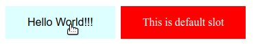

# {{ name }}

> {{ description }}

<!-- Use https://github.com/phw/peek or https://github.com/ShareX/ShareX to record your component in action as gif -->


## Installation

### via NPM

```bash
npm install --save {{name}}
# or if you use yarn
yarn add {{name}}
```

then you can import it

```js
import {{pascalCase name}} from '{{name}}'
```

### via CDN

```html
<script src="https://unpkg.com/vue"></script>
<script src="https://unpkg.com/{{name}}"></script>
```

## Usage

### Example

```html
<{{name}} hello="Hello world!!!" @click="clicked">
</{{name}}>
```

```js
export default {
  components: {
    {{pascalCase name}}
  },
  methods: {
    clicked (helloText) {
      console.log(helloText)
    }
  }
}
```

> For more comprehensive example, open one of `<story>/<scenario>.vue` in [./src/stories](./src/stories)

### Props

| Prop name | Description | Type | Required | Default value |
|---------- |-------- |---------- |---------- |---------- |
| `hello` | set hello text | `String` | no | `''` |

### Events

| Event name | Description | Parameters |
|---------- |-------- |---------- |
| `click` | fire when hello text is clicked | helloText: `String` |

### Slots

| Slot name | Description | Accepted Element | Slot scope |
|---------- |-------- |---------- |---------- |
| `default` | slot without name are placed in default | `any` | `NaN` |

---

## Extending {{name}}

In case if you want to extend and/or override {{name}} basic functionality.

### Example

```js
export default {
  extends: {{pascalCase name}},
  methods: {
    clicked (helloText) {
      console.log('this execute first', helloText)
    }
  }
}
```

### Methods

| Method name | Description | Parameters |
|---------- |-------- |---------- |
| `clicked` | execute when button is clicked | helloText: `String` |

---

## Contributing

See [CONTRIBUTING.md](./CONTRIBUTING.md) for development guide.

---
This component was generated with [vue-authoring-template](https://github.com/DrSensor/vue-authoring-template) using [vue-cli](https://github.com/vuejs/vue-cli).
